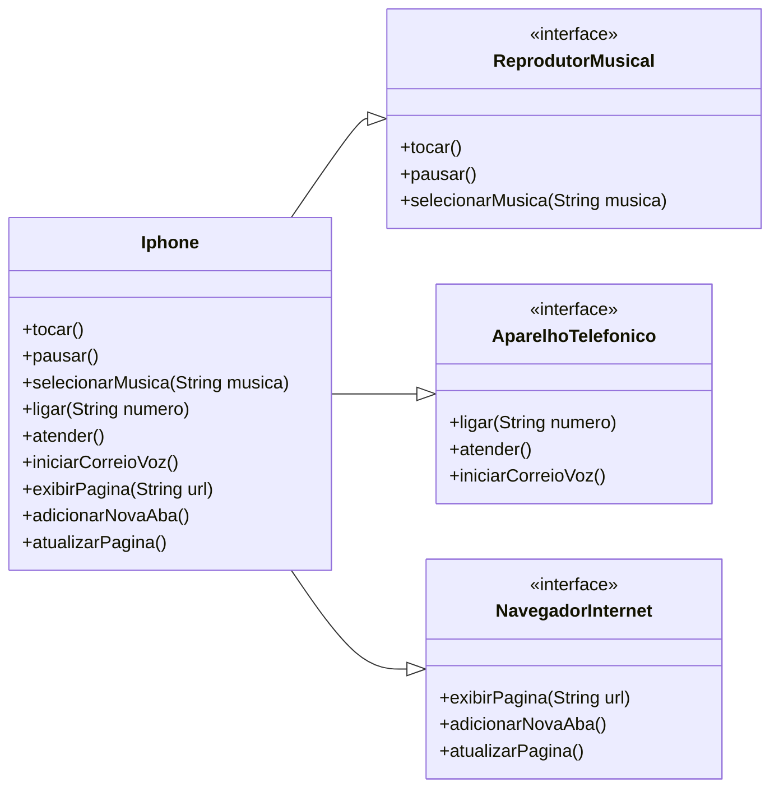

**Modelagem e Diagramação de um Componente iPhone**
Este projeto apresenta a modelagem e a implementação em Java de um componente que representa as funcionalidades essenciais do primeiro iPhone, lançado em 2007. O desafio se baseia na famosa apresentação de Steve Jobs.

🎯 Contexto
O objetivo foi abstrair e modelar, através de um diagrama de classes UML e código Java, as funcionalidades principais do iPhone conforme o vídeo de lançamento. A ênfase foi na aplicação de boas práticas de programação orientada a objetos, como o uso de interfaces para definir os "papéis" que o dispositivo desempenha.

✨ Funcionalidades Modeladas
O componente Iphone centraliza as seguintes funcionalidades:

1. Reprodutor Musical
   tocar()
   pausar()
   selecionarMusica(String musica)
2. Aparelho Telefônico
   ligar(String numero)
   atender()
   iniciarCorreioVoz()
   3. Navegador na Internet
      exibirPagina(String url)
      adicionarNovaAba()
      atualizarPagina()
      UML - Diagrama de Classes
      O diagrama abaixo ilustra a estrutura do projeto. A classe Iphone implementa as três interfaces, cada uma representando uma das funcionalidades principais do dispositivo.
      

📁 Estrutura do Projeto
O projeto está organizado nos seguintes arquivos Java:

Interfaces:
   ReprodutorMusical.java: Contrato para as funcionalidades de música.
   
   AparelhoTelefonico.java: Contrato para as funcionalidades de telefone.
   
   NavegadorInternet.java: Contrato para as funcionalidades de navegação web.
   
Classe Concreta:

   Iphone.java: Implementação das três interfaces, unificando os comportamentos.
   
Classe de Execução:

   Main.java: Ponto de entrada para demonstrar o uso da classe Iphone.
